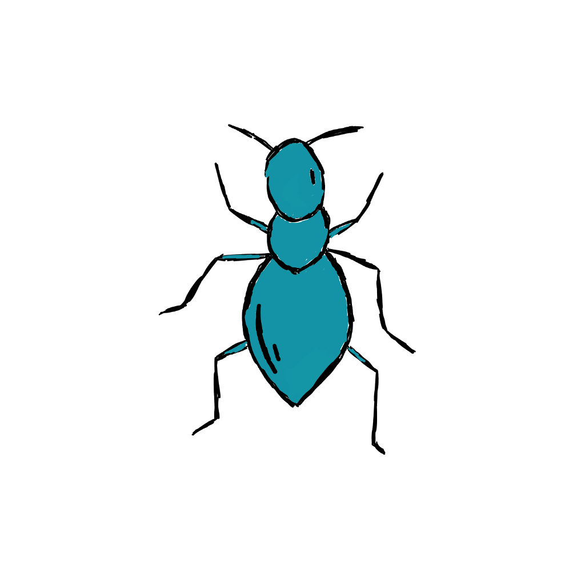

# hiveGo <br/>

[Hive game (wikipedia)](https://en.wikipedia.org/wiki/Hive_(game)), backed by an [AlphaZero (wikipedia)](https://en.wikipedia.org/wiki/AlphaZero) 
based AI, using [GoMLX (an ML framework for Go)](https://github.com/gomlx/gomlx) .



## Command-line UI

```
    go install github/janpfeifer/hiveGo/cmd/hive@latest
```

* To play vs a default AI: `hive`
* To watch AIs playing against each other: `hive -watch`
* Hotseat mode: `hive -hotseat`
* See `hive -help` for more options.


It uses the [GoMLX](https://github.com/gomlx/gomlx) Go backend  by default, so nothing else is needed to install. 
If you want the "accelerated" version, based on [OpenXLA](https://openxla.org/), install the XLA
libraries (see [GoMLX Installation](https://github.com/gomlx/gomlx?tab=readme-ov-file#installation)), and install **hive** command with:

```
    go install -tags xla github/janpfeifer/hiveGo/cmd/hive@latest
```


## Gnome Version

> [!WARNING]
> 🚧🛠 Currently broken 🚧🛠 <br/>

Easy to build in XWindows -- well, more or less, depending on the dependencies working out fine. Probably one could compile it in windows as well ... 

TODO: use Fyne to make it portable?

```
    go run github/janpfeifer/hiveGo/cmd/gnome-hive
```


## Web Version

> [!WARNING]
> 🚧🛠 Currently broken 🚧🛠 <br/>
> This has to be updated from the 2018 version.


The Gnome version works nicely ... but asking anyone to install it is cruel. And I wouldn't want to distribute a binary -- then I would have to try to compile everything statically.
So instead, why not a web version ... duh, I should have done this first, but I wanted to try out coding for Gnome.

## About The Project

This is an experimental / educative project to learn the AlphaZero algorithm and RL in general.

It was originally a 2018 project using TensorFlow, refreshed in 2025 to use [GoMLX](https://github.com/gomlx/gomlx),
a feature-full ML framework for Go.

What is working right now:

1. The command-line UI, see below.
2. AIs, using a basic set of features for the board (lots that can be improved here)
   a. AlphaBeta-Pruning: using a straight forward FNN (Feedforward Neural Network) model.
   b. Alpha-Zero: using a tiny GNN (Graph Neural Network) model. Still, very simple features.

It already beats me every time, and when I pitched it against some commercially available Hive game, both AIs won
every time.

## Trainers

Allows playing games among AI's automatically. 

* Play new games. Optionally save the games.
* Load and rescore old games.
* Compare AIs
* Train models while playing the game.
* Can train TF models.
* Can distill from previous models: very handy to quickly ramp up a new model to a moderate quality model.
* Two trainers: ab-trainer (for AlphaBeta Pruning) and a0-trainer (for the AlphaZero models).

## Hexagonal Convolutional model

> [!WARNING]
> 🚧🛠 Currently broken 🚧🛠 <br/>
> The GoMLX version doesn't yet implemented the convolutional model.
> But also, the better idea would be to do a transformer based model.

The latest, more fancy model, uses the full board as input to the NN, and
runs a bunch of layers of convolution on that, with residual connections.

The convolutions for hexagonal mappings require some extra care, since the
neighbourhood kernel is different depending if one are on odd/even columns.

See experiments in [this colab](https://colab.research.google.com/drive/1r4P5Uc3S5Lw3sznEVMrbF3H9HkskZH6S)

## Thanks

* Thanks for Florence Poirel for the awesome drawings!
* The project started from [earlier version in Python](https://github.com/makatony/hiveAI), but it was greatly improved since.

Background pictures:
* Winning pattern from [pexels.com/light-creative-abstract-colorful-134](https://www.pexels.com/photo/light-creative-abstract-colorful-134/)

